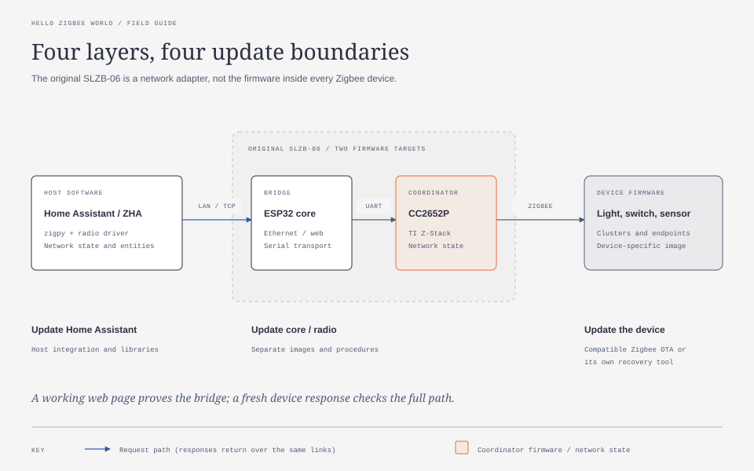
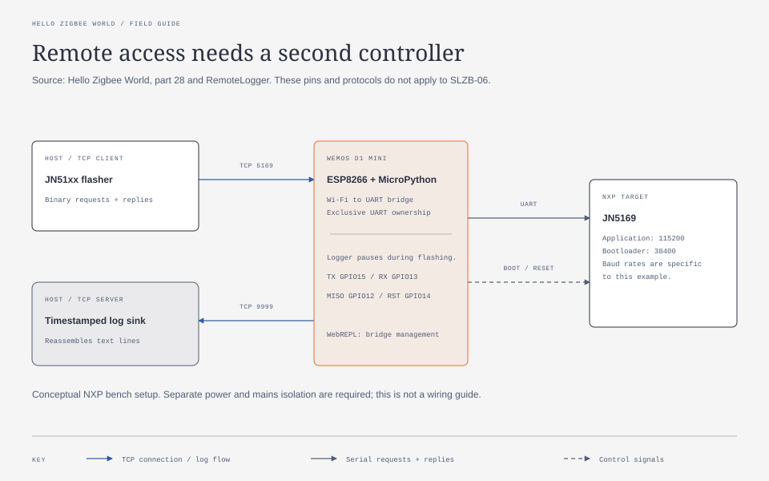
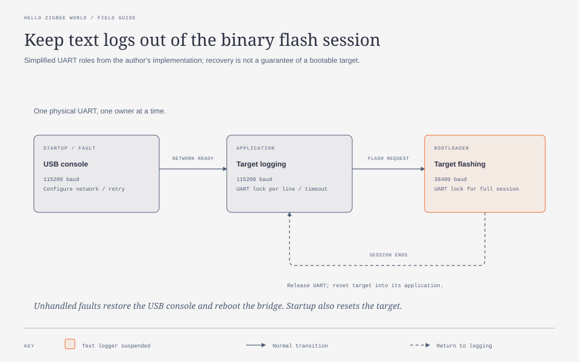

# SLZB-06 recovery notes and tools

Practical recovery, backups, firmware upgrades, and troubleshooting for the
**original SMLIGHT SLZB-06: ESP32 + Texas Instruments CC2652P**. This is an
independent community project, not SMLIGHT support or firmware distribution.
It does **not** apply unchanged to SLZB-06M, P7, P10, or other variants.

There are two separate firmware targets:

- **ESP32 core** runs Ethernet, the web interface, and the serial bridge.
  Core `0.9.9` can serve HTTP and carry a Zigbee firmware update even when a
  modern core image will not fit its OTA partition.
- **CC2652P radio** runs the Zigbee coordinator and stores network state.
  Updating it over Ethernet does not upgrade the ESP32 core. Erasing it can
  require restoring the existing Zigbee network from a verified backup.

Our [case study](docs/case-study.md) records unsuccessful core OTA attempts,
a verified radio upgrade to Z-Stack `20240710`, and recovery of three live
device reads after repositioning/reconnection. A later USB migration captured
a verified full 16 MiB backup and successfully wrote and booted core `2.5.2`.
**Post-core Ethernet and three fresh live Zigbee reads also recovered** after
bypassing the GS110TP PoE path and correcting the core's USB/LAN mode. The
fresh complete network backup passed all 12 comparisons with pre-core state.
The exact cause of the GS110TP path failure was not isolated. Read the separate
firmware, network, and live-response checkpoints before choosing a procedure.

## Start here

**[Follow the complete upgrade and recovery runbook](docs/upgrade-runbook.md).**
It puts the entire route in order: identify → back up → understand the failed
OTA path → upgrade/validate the radio → prepare USB → snapshot all ESP32 flash
→ write/boot core `2.5.2` → verify runtime connectivity. It includes runnable
commands, exact upstream images/checksums, stop points, and rollback limits.

- For the evidence and final recovery outcome, read the
  [chronological case study](docs/case-study.md).
- For a fault without a planned upgrade, start with
  [troubleshooting by layer](docs/troubleshooting.md).
- For detailed procedures, the runbook links [backups](docs/backups.md),
  [radio flashing](docs/radio-firmware.md), [core partition limits](docs/core-firmware.md),
  [USB flashing](docs/usb-core-upgrade.md), and [Synology VMM](docs/synology-usb-passthrough.md).

See [device capabilities and other options](docs/capabilities.md) for transport,
power, coordinator/router roles, and the limits of later Thread/Bluetooth options.

Use stable power and a **wired** host for radio flashing through the legacy
bridge. Disable ZHA/Zigbee2MQTT while a flasher owns the serial connection.
Keep the antenna attached. Do not reset the network, delete the integration,
or re-pair devices merely because the coordinator has become unavailable.

## Zigbee field guide: from firmware to recovery

An original, condensed reading guide to **Oleksandr Masliuchenko's
[Hello Zigbee World, parts 0–28](https://github.com/grafalex82/hellozigbee/blob/main/doc/part0_plan.md)**,
including [part 28 on remote logging and flashing](https://medium.com/@omaslyuchenko/hello-zigbee-world-part-28-remote-logging-and-flashing-of-zigbee-devices-2c0c60ff3ccb).
The author's [public Markdown edition](https://github.com/grafalex82/hellozigbee/tree/main/doc)
is the source for this synthesis; it is not a translation or a copy of the articles.

**Hardware boundary:** the series develops NXP **JN5169** device firmware,
eventually for Aqara wall switches, and uses an **ESP8266** for remote debugging.
Our adapter is **ESP32 + TI CC2652P**. The architecture lessons transfer;
firmware images, bootloader commands, pins, and baud rates do not. The following
is source analysis, not a report of additional hardware tests.



### What the whole series teaches

Build a device in layers: first reliable local firmware, then network membership,
then a useful application interface, then recovery and tests. Joining a network
does not prove that discovery, commands, reporting, or reconnecting after a power
failure work. Each needs its own evidence.

<details>
<summary><strong>All 29 parts — one practical takeaway each</strong></summary>

- [0 · Plan](https://github.com/grafalex82/hellozigbee/blob/main/doc/part0_plan.md): prove features on a development board before adapting a mains-powered switch.
- [1 · Bring-up](https://github.com/grafalex82/hellozigbee/blob/main/doc/part1_bring_up.md): validate startup, GPIO, UART, and the watchdog before adding Zigbee.
- [2 · Timers and queues](https://github.com/grafalex82/hellozigbee/blob/main/doc/part2_timers_queues.md): move work through events rather than blocking interrupt handlers.
- [3 · Sleep modes](https://github.com/grafalex82/hellozigbee/blob/main/doc/part3_sleep_modes.md): choose what state survives sleep and what must be restored on waking.
- [4 · Zigbee basics](https://github.com/grafalex82/hellozigbee/blob/main/doc/part4_zigbee_basics.md): distinguish radio transport, network roles, endpoints, and application clusters.
- [5 · Stack initialization](https://github.com/grafalex82/hellozigbee/blob/main/doc/part5_zigbee_init.md): establish memory, callbacks, and an event loop before implementing device behavior.
- [6 · First join](https://github.com/grafalex82/hellozigbee/blob/main/doc/part6_join_zigbee_network.md): inspect the join exchange; an initial connection is only the first milestone.
- [7 · Discovery](https://github.com/grafalex82/hellozigbee/blob/main/doc/part7_zigbee_descriptors.md): descriptors and Basic-cluster attributes tell the controller what it has joined.
- [8 · Simple switch](https://github.com/grafalex82/hellozigbee/blob/main/doc/part8_simple_switch.md): synchronize physical state, remote On/Off commands, and reported attributes.
- [9 · C++ foundations](https://github.com/grafalex82/hellozigbee/blob/main/doc/part9_cpp_building_blocks.md): wrap timers, GPIO, queues, and persistent values around the constrained vendor toolchain.
- [10 · Join and rejoin](https://github.com/grafalex82/hellozigbee/blob/main/doc/part10_joining_rejoining.md): preserve network membership and distinguish reconnection from factory reset.
- [11 · Sleepy devices](https://github.com/grafalex82/hellozigbee/blob/main/doc/part11_end_device.md): parent polling trades response latency against battery consumption.
- [12 · Rejoin after sleep](https://github.com/grafalex82/hellozigbee/blob/main/doc/part12_end_device_rejoin.md): make parent loss and retry timing explicit parts of normal operation.
- [13 · Firmware structure](https://github.com/grafalex82/hellozigbee/blob/main/doc/part13_project_cpp_structure.md): separate device, endpoint, and cluster responsibilities so features remain composable.
- [14 · Reporting and binding](https://github.com/grafalex82/hellozigbee/blob/main/doc/part14_reports_binding.md): send attribute updates to bound destinations; reports describe state.
- [15 · Command binding](https://github.com/grafalex82/hellozigbee/blob/main/doc/part15_commands_binding.md): compatible client/server clusters let a switch command another device directly.
- [16 · Button actions](https://github.com/grafalex82/hellozigbee/blob/main/doc/part16_multistate_action.md): represent clicks, holds, and releases explicitly instead of flattening everything into On/Off.
- [17 · Custom configuration](https://github.com/grafalex82/hellozigbee/blob/main/doc/part17_custom_cluster.md): expose behavior through attributes when users should not need a firmware rebuild.
- [18 · Zigbee2MQTT integration](https://github.com/grafalex82/hellozigbee/blob/main/doc/part18_zigbee2mqtt_converter.md): map device-specific attributes and actions into controller-facing features.
- [19 · Dimming commands](https://github.com/grafalex82/hellozigbee/blob/main/doc/part19_level_control.md): use Move, Step, and Stop semantics, including stopping when a button is released.
- [20 · Dimmable output](https://github.com/grafalex82/hellozigbee/blob/main/doc/part20_dimmable_light.md): implement transitions and state reporting behind a Level Control server.
- [21 · Hardware tests](https://github.com/grafalex82/hellozigbee/blob/main/doc/part21_test_automation.md): drive real firmware through MQTT and UART, and assert observable behavior.
- [22 · Identify](https://github.com/grafalex82/hellozigbee/blob/main/doc/part22_identify_cluster.md): give installers visible feedback about which physical device or channel they selected.
- [23 · Groups](https://github.com/grafalex82/hellozigbee/blob/main/doc/part23_groups.md): explicit Zigbee group membership enables one group-addressed command to reach multiple devices.
- [24 · Persistence and polish](https://github.com/grafalex82/hellozigbee/blob/main/doc/part24_misc_improvements.md): persist reporting settings and finish endpoint and multi-button behavior.
- [25 · Device OTA](https://github.com/grafalex82/hellozigbee/blob/main/doc/part25_ota_updates.md): match image metadata, storage layout, transfer, validation, and activation to the target firmware.
- [26 · Aqara hardware](https://github.com/grafalex82/hellozigbee/blob/main/doc/part26_QBKG12LM_support.md): adapt pin assignments and board behavior; a working development board is not a finished port.
- [27 · Serial flasher](https://github.com/grafalex82/hellozigbee/blob/main/doc/part27_flash_tool.md): use the JN51xx bootloader's framed binary protocol to access flash and EEPROM.
- [28 · Remote access](https://github.com/grafalex82/hellozigbee/blob/main/doc/part28_remote_logger.md): place a second controller beside the target to collect UART logs and switch into flashing mode.

</details>

### Remote logging and flashing: the useful mechanism

In [part 28](https://github.com/grafalex82/hellozigbee/blob/main/doc/part28_remote_logger.md),
the ESP8266 sends target logs to a host and accepts flashing connections in the
opposite direction. GPIO control makes the target bootloader reachable without
pressing its buttons. WebREPL keeps bridge management available while its UART
is assigned to the target.



The [RemoteLogger implementation](https://github.com/grafalex82/RemoteLogger/tree/99d1068de35d549ce56bc84ea4e12199c629114c)
uses TCP **9999** for the host log collector and TCP **5169** for the bridge's
flashing server. Its UART manager selects **115200 baud** for console/logging
and **38400 baud** for JN5169 programming. A mutex excludes the text reader
throughout the binary flashing session.



This is a prototype to study, not a ready-made SLZB service. Failure handling
reboots the bridge and startup resets the target; that is not transparent
operation or guaranteed recovery. Logs are not durably queued. Keep these
management services on a trusted network. The article also needed a separate
ESP power supply. Its mains-powered switch must be isolated before attaching
USB or test equipment; neither diagram is an electrical wiring guide.

### Apply the lessons to ZHA and this adapter

- **Choose the correct update path.** Zigbee device OTA needs a running OTA
  client and a compatible image. Serial recovery needs a reachable bootloader.
  Neither updates every layer in the first diagram. ZHA's endpoint OTA support
  and third-party coordinator firmware are separate concerns; see the
  [ZHA documentation](https://www.home-assistant.io/integrations/zha/).
- **Translate integration code deliberately.** The series' JavaScript converter
  is for Zigbee2MQTT. ZHA uses its own device handling and, when necessary,
  [quirks](https://www.home-assistant.io/integrations/zha/#how-to-add-support-for-new-and-unsupported-devices).
  We have not validated the author's custom firmware with ZHA.
- **Identify the log layer.** ZHA/zigpy diagnostics describe the host's exchanges;
  they do not automatically include a device MCU's internal UART debug output.
  A debug bridge requires an actual accessible debug interface.
- **Give the flasher exclusive access.** Stop ZHA before using this adapter's
  serial bridge for a radio update. Preserve a
  [ZHA network backup](docs/backups.md) separately from an
  [ESP32 flash snapshot](docs/usb-core-upgrade.md).
- **Verify beyond “online.”** After recovery, check network identity and perform
  fresh device reads. A responding web page or a successful firmware write
  does not establish Zigbee radio operation. Follow the
  [tested runbook](docs/upgrade-runbook.md), not the NXP example's pins or commands.
- **Test outages and group behavior.** Include rejoin, delayed responses,
  persisted reporting, and one unavailable lamp. A dashboard group alone does
  not establish the on-device membership discussed in part 23.

Ethernet access does not imply a TFTP recovery service or space for a larger
OTA image. Our [core partition analysis](docs/core-firmware.md) determines what
can actually be written on the legacy unit.

[SVG files, editable HTML sources, and regeneration instructions](docs/diagrams/README.md)
use the requested light **diagram-design** style. Source revisions and the
boundary between research and hardware evidence are recorded in
[sources](docs/sources.md#hello-zigbee-world-field-guide).

## Tools

Requires Python 3.12+ for the full workflow. The HTTP and firmware download
helpers use the standard library. Home Assistant access needs `requirements-ha.txt`;
the legacy radio wrapper needs `requirements-radio.txt` on a Linux host, and
the USB core helper needs `requirements-core.txt`. None of the commands below
flashes firmware.

For firmware downloads, use CPython with its standard verified HTTPS defaults
and OpenSSL security level 2 or higher. Run the
[TLS runtime check](docs/security-design.md#firmware-downloader-https-profile)
with the same interpreter before downloading. Keep that runtime updated; do not
lower its TLS security settings to accept a weak server certificate.

Use the same verified TLS profile for HTTPS coordinator URLs and Home Assistant
HTTPS/WSS access. Install the hash-locked Home Assistant dependencies and check
that virtual environment's interpreter; see the
[Home Assistant and coordinator profile](docs/security-design.md#home-assistant-and-coordinator-httpswss-profile).
Plain HTTP recovery remains limited to an isolated trusted network.

```sh
python3 scripts/slzb.py --url http://192.0.2.10 status
python3 scripts/slzb.py --help
python3 scripts/radio_legacy.py --help
python3.12 -m venv .venv-ha
.venv-ha/bin/python -m pip install --require-hashes -r requirements-ha.txt
.venv-ha/bin/python -m unittest discover -s tests -v
```

`192.0.2.10`, `ha.example.test`, and example MAC addresses in this project are
documentation placeholders. Replace them with identities you have independently
checked. The status helper deliberately omits IP/MAC and Wi-Fi settings from its
output; backup files still contain sensitive data.

- `scripts/slzb.py`: legacy status, private configuration export, guarded
  app-only core OTA upload. OTA is a dry run without `--execute`; it also needs
  a checksum and an independently established slot size.
- `scripts/ha_zha.py`: fresh complete ZHA backup, deliberate disable/enable/reload,
  and an uncached Basic-cluster read. Lifecycle changes require `--execute`.
- `scripts/fetch_firmware.py`: download and hash-check the specific upstream
  CC2652P `20240710` image used in this case study.
- `scripts/radio_legacy.py`: adapt SMLIGHT's `0.1.7` flasher to the `0.9.9` API
  and small legacy bridge buffers. Dry run by default; only the tested image
  hash is accepted.
- `scripts/compare_network.py`: compare private before/after network identity
  and key data without printing secret values.
- `scripts/esp32_core.py`: [complete USB backup and exact core-2.5.2 migration](docs/usb-core-upgrade.md),
  with pinned esptool, chip/security checks, verified backup freshness, and
  explicit execution. See also the [temporary Synology VMM USB path](docs/synology-usb-passthrough.md).

These tools do not automatically recover from failed flashes, promise zero
downtime, or prove that a backup can be restored on every software version.
The guards reduce common mistakes but cannot verify physical hardware or power.
The USB helper is generalized from the private scripts used on hardware and
has offline tests; the exact published helper has not itself completed a
hardware flash. See the runbook for the boundary between recorded operations
and reusable tooling.

## Public repository boundary

Keep firmware downloads in ignored `artifacts/`, and backups/logs in ignored
`backups/` or `private/`. **Never commit Zigbee network backups, `zigbee.db`,
Home Assistant `.storage`, access tokens, Wi-Fi credentials, real household
addresses, raw diagnostics, or Terraform state.** `.gitignore` is only a guard;
inspect the staged diff before publishing anything.

Repository settings are managed by
[HA Homelab Terraform](https://github.com/4alvit/terraform-github-ha-homelab).
CI runs offline tests and syntax checks; it never talks to household hardware.

See [sources and evidence](docs/sources.md) for upstream documentation and
the distinction between observed behavior, source analysis, and hypotheses.

## License

[MIT](LICENSE) for original documentation and helpers. Firmware is downloaded
from its upstream project and remains under its own terms. The SMLIGHT flasher
is an external Apache-2.0 dependency; it is not vendored here.

## Project maintenance

See [contribution and test requirements](CONTRIBUTING.md), the
[security reporting policy](SECURITY.md), [security design](docs/security-design.md),
and the [OpenSSF evidence and remaining criteria](docs/openssf-evidence.md).
